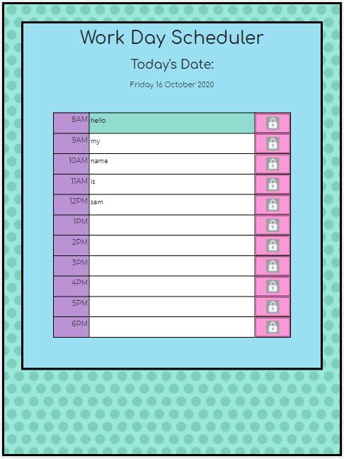

# My Day Planner

## Description

The project is to create a day planner for the work hours of the day. Each time block will be editable with the ability to save the contents to local storage and display the future, current and past hours by way of colour coding. 

The planner displays the current date. There is only one day available. 

## Contents: 
1. Installation 
2. Usage
3. Improvements
4. Credits
5. License

## Instalation

To open the planner please [click this link](https://samwakelam.github.io/05_WORK_DAY_SCHEDULER_SLW/).   
The project can be found at: https://github.com/Samwakelam/05_WORK_DAY_SCHEDULER_SLW

I have used css, bootstrap, jquery, and javascript, to run my html.

## Usage

The planner is quite simple to use. Simply click on the time block you wish to amend and input your schedule. Click on the lock icon at the end of the row to save the data. To clear an entry, delete the contents and click save again. 

.

This project was fairly straight forward. 

## Improvements

Improvements to make would be to add additional pages to the planner so you can save your future days events.  

## Credits 

Resources I have referenced:   
W3Schools  
StackOverflow   

## License 

I have drawn the graphics myself and they are copyright 2020. No useage without permission. 

Please feel free to make suggestions and improvement on the workings of the quiz and use the code as a base for your own if you wish. you must make reference where the code originated if you do. I would also love to see what changes and improvements you make.  

Design by Samantha Wakelam, please respect copyright 2020. 

 